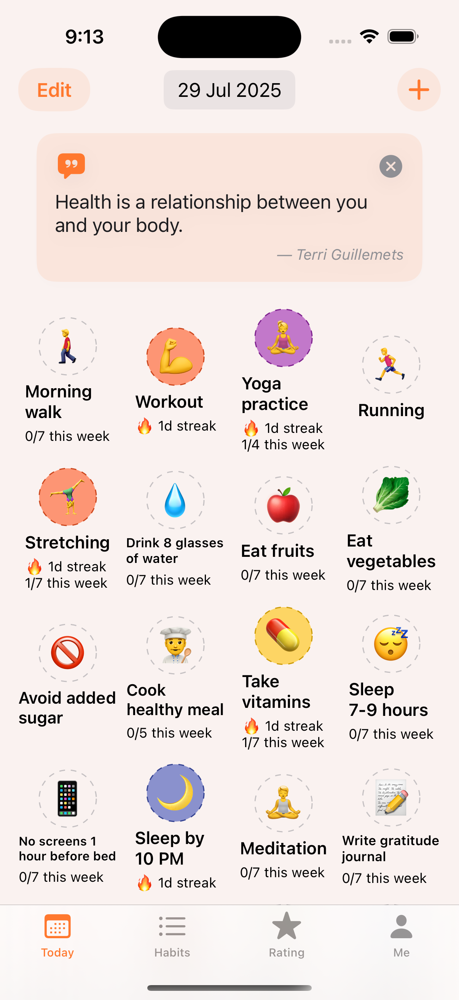
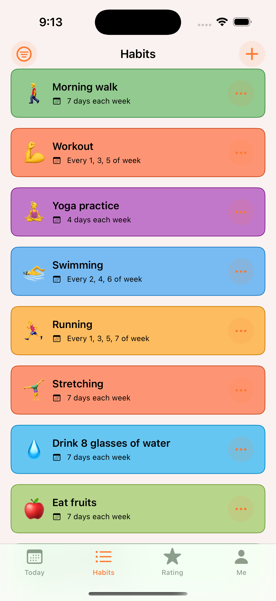
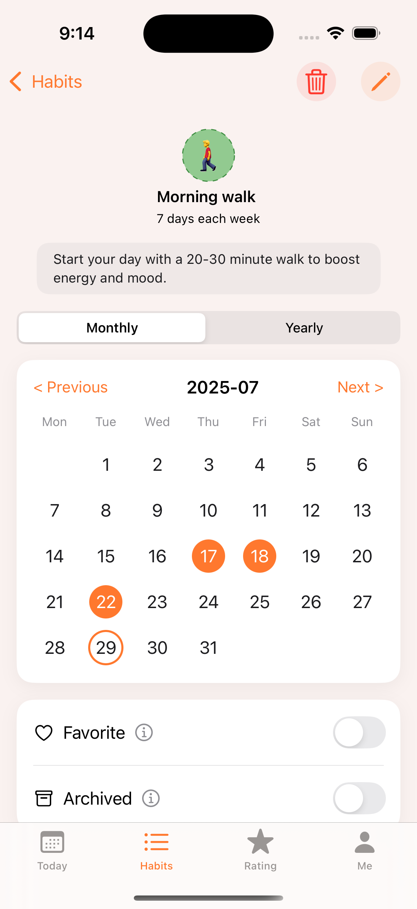
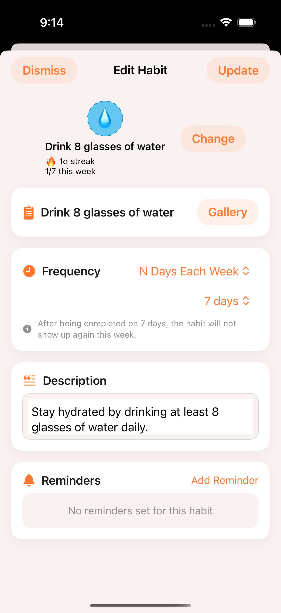

# HabitDiary 📔

[](https://swift.org)
[](https://developer.apple.com/ios/)
[](https://developer.apple.com/xcode/swiftui/)
[](https://creativecommons.org/licenses/by-nc/4.0/)

A comprehensive iOS habit tracking app built with SwiftUI and GRDB, designed to help users build and maintain habits through gamification, achievements, and a sophisticated rating system. Transform your life one habit at a time with intelligent tracking, personalized reminders, and motivational features.

## 📱 Screenshots

<div align="center">
  
  
  
  
</div>

*Experience a clean, modern interface with intuitive habit tracking, comprehensive analytics, and engaging gamification elements designed to motivate long-term habit formation.*

## ✨ Features

### 🎯 Core Functionality
- **Comprehensive Habit Tracking**: Create, edit, and track habits with flexible frequency patterns
- **4 Main Sections**: Today (daily tracking), Habits (management), Rating (progress), Me (profile/settings)
- **Flexible Scheduling**: Fixed days in week/month, N days per period, and custom patterns
- **Visual Progress Tracking**: Calendar views, streak counters, and completion analytics

### 🏆 Gamification & Achievements
- **15+ Achievement Types**: Streak milestones, consistency rewards, perfect periods, and milestone celebrations
- **Real-time Notifications**: Achievement popup celebrations with visual animations
- **Progressive Unlocking**: Earn achievements based on streaks, total check-ins, and consistency patterns
- **Social Sharing**: Share your achievements and progress with friends

### 📊 12-Tier Rating System
- **Progression Levels**: Advance from Beginner (F) to Legend (SSS) based on overall performance
- **Multi-Dimensional Scoring**: 
  - Active habits (max 300 points)
  - Achievements unlocked (max ~150+ points)
  - Total check-ins (max 200 points)
  - Longest streak (max 250 points)
- **Detailed Analytics**: Score breakdowns with explanations and improvement suggestions
- **Visual Progress**: Charts and progress bars showing rating advancement

### 🗂️ Comprehensive Habit Library
- **35+ Pre-built Habits** across 8 major categories:
  - **Health & Fitness**: Walking, workouts, yoga, swimming, running, stretching
  - **Nutrition & Hydration**: Water intake, fruits, vegetables, healthy cooking
  - **Sleep & Rest**: Sleep schedule, screen limits, bedtime routines
  - **Mental Health & Mindfulness**: Meditation, gratitude, breathing exercises
  - **Learning & Growth**: Reading, language learning, skill practice
  - **Productivity & Organization**: Planning, workspace management, reviews
  - **Social & Relationships**: Family calls, social activities, kindness acts
  - **Self-Care & Environment**: Skincare, decluttering, outdoor time
  - **Creative & Hobbies**: Creative activities, music, photography

### 🔔 Smart Reminder System
- **Personalized Notifications**: Custom reminder times and messages for each habit
- **Habit-Specific Alerts**: Link reminders directly to individual habits
- **Non-intrusive Design**: Thoughtful notification timing to avoid overwhelm
- **Easy Management**: Simple setup and modification of notification preferences

### 🎨 User Experience
- **Modern SwiftUI Interface**: Clean, intuitive design following iOS design guidelines
- **Dark Mode Support**: Automatic adaptation to system appearance preferences
- **Custom Theming**: Multiple color themes and personalization options
- **Haptic Feedback & Sound Effects**: Enhanced interaction feedback
- **Smooth Animations**: Polished transitions and micro-interactions

### 💾 Data Management
- **GRDB Database**: Robust local data storage with SQLite backend
- **Calendar Integration**: Monthly and yearly habit tracking visualizations
- **Streak Calculation**: Intelligent streak tracking with flexible rules
- **Data Persistence**: Reliable local storage with efficient querying

### 🌍 Localization & Accessibility
- **Multi-language Support**: English and Simplified Chinese localization
- **Accessibility Features**: VoiceOver support and accessibility labels
- **Responsive Design**: Optimized for various iOS device sizes

### 🔧 Advanced Features
- **Habit Archiving**: Archive habits without losing historical data
- **Icon Customization**: Extensive emoji icon library with color coding
- **Filtering & Sorting**: Multiple options to organize habit views
- **Onboarding Experience**: 4-step guided setup with feature introduction
- **Premium Features**: In-app purchases with ad-free experience

## 🏗️ Architecture

### Tech Stack
- **SwiftUI 5.0**: Modern declarative UI framework
- **GRDB**: SQLite database with Swift integration and reactive queries
- **Observation Framework**: Reactive data binding and state management
- **SwiftUINavigation**: Type-safe navigation handling
- **Google Mobile Ads**: Monetization with respectful ad placement
- **UserNotifications**: Local notification scheduling and management

### Project Structure
```
HabitDiary/
├── App/
│   └── HabitDiaryApp.swift              # App entry point with dependency setup
├── Components/
│   ├── Common/                          # Reusable UI components
│   │   ├── HabitCardView.swift
│   │   ├── HabitItemView.swift
│   │   ├── EmptyStateView.swift
│   │   └── StyleGuide.swift
│   ├── Today/                           # Daily habit tracking interface
│   │   ├── TodayView.swift
│   │   └── TodayViewModel.swift
│   ├── Habits/                          # Habit management and gallery
│   │   ├── HabitsList.swift
│   │   ├── HabitForm.swift
│   │   ├── HabitDetail.swift
│   │   └── HabitsGallery.swift
│   ├── Rating/                          # Progress scoring and analytics
│   │   ├── RatingView.swift
│   │   ├── RatingViewModel.swift
│   │   └── ScoreDetailView.swift
│   ├── Me/                              # User profile and settings
│   │   ├── MeFeature.swift
│   │   ├── SettingView.swift
│   │   ├── UserStatsView.swift
│   │   └── ThemeColorView.swift
│   ├── Achievements/                    # Gamification system
│   │   ├── AchievementsView.swift
│   │   └── AchievementPopupView.swift
│   ├── Reminders/                       # Notification management
│   │   ├── RemindersView.swift
│   │   ├── ReminderForm.swift
│   │   └── ReminderRow.swift
│   └── Onboarding/                      # User introduction flow
│       └── OnboardingView.swift
├── Model/                               # Core data models
│   ├── Habit.swift                      # Main habit entity with frequency patterns
│   ├── CheckIn.swift                    # Habit completion tracking
│   ├── Achievement.swift                # Gamification achievements
│   ├── LongevityRating.swift           # 12-tier rating system
│   ├── Reminder.swift                   # Notification scheduling
│   └── TodayHabit.swift                # Daily habit view model
├── Service/                             # Business logic and data services
│   ├── HabitsDataStore.swift           # Pre-built habit templates
│   ├── AchievementService.swift        # Achievement logic and notifications
│   ├── NotificationService.swift       # Reminder scheduling and management
│   ├── RatingService.swift             # Score calculation and rating logic
│   └── PurchaseManager.swift           # In-app purchase handling
├── Utilities/                           # Helper functions and extensions
│   ├── Constants.swift
│   ├── Schema.swift                     # Database schema and migrations
│   ├── Extension/
│   │   ├── Color+Extensions.swift
│   │   └── Date+Extension.swift
│   └── SoundPlayer.swift               # Audio feedback system
└── Modules/
    └── MoreApps/                        # Developer's other applications showcase
```

## 🚀 Getting Started

### Prerequisites
- Xcode 15.0 or later
- iOS 17.0+ deployment target
- macOS 14.0+ (for development)
- Swift 5.9+

### Installation

1. **Clone the repository**
   ```bash
   git clone https://github.com/banghuazhao/habit-diary.git
   cd habit-diary
   ```

2. **Open in Xcode**
   ```bash
   open HabitDiary.xcodeproj
   ```

3. **Configure Dependencies**
   The project uses Swift Package Manager for dependencies:
   - GRDB for database management
   - Google Mobile Ads for monetization
   - Additional utility packages

4. **Build and Run**
   - Select your target device or simulator
   - Press `Cmd + R` to build and run the app

### Development Setup

#### Database Configuration
The app uses GRDB for local data storage. The database is automatically initialized with the following tables:
- `habits` - Core habit definitions with frequency patterns
- `checkIns` - Daily completion tracking with timestamps
- `reminders` - Notification scheduling and management
- `achievements` - Gamification progress tracking

#### Customization Options
- **Habit Categories**: Extend the `HabitsDataStore` to add new pre-built habits
- **Achievement Types**: Modify `AchievementDefinitions` to create new achievements
- **Rating Tiers**: Adjust the 12-tier system in `LongevityRating.swift`
- **UI Themes**: Customize colors and styling through the theme manager

## 🎮 User Journey

### Onboarding Experience
1. **Welcome**: Introduction to HabitDiary's mission and benefits
2. **Features**: Showcase of rating system, achievements, and capabilities
3. **Habit Selection**: Choose from 35+ categorized habit templates
4. **Setup Complete**: Personalized tips and guidance for getting started

### Daily Workflow
1. **Morning Check**: Open Today tab to see scheduled habits
2. **Track Progress**: Tap habits to mark as complete with satisfying animations
3. **Build Streaks**: Maintain consistency to unlock achievements
4. **Monitor Growth**: Check Rating tab to see score progression

### Long-term Engagement
- **Achievement Unlocking**: Celebrate milestones with popup notifications
- **Rating Advancement**: Progress from Beginner (F) to Legend (SSS)
- **Habit Evolution**: Add new habits and archive completed ones
- **Data Insights**: Review historical data and identify patterns

## 🤝 Contributing

We welcome contributions to make HabitDiary even better! Here's how you can help:

### Development Process
1. Fork the repository
2. Create a feature branch (`git checkout -b feature/amazing-feature`)
3. Make your changes following our coding standards
4. Test thoroughly on multiple devices and iOS versions
5. Commit your changes (`git commit -m 'Add amazing feature'`)
6. Push to the branch (`git push origin feature/amazing-feature`)
7. Open a Pull Request with detailed description

### Code Style Guidelines
- Follow Swift API Design Guidelines
- Use meaningful variable and function names
- Document complex logic with comments
- Ensure all code compiles without warnings
- Write unit tests for new functionality where appropriate

### Testing Requirements
- Test on both iPhone and iPad simulators
- Verify functionality across iOS 17+ versions
- Test edge cases and error scenarios
- Validate accessibility features
- Check database migrations and data integrity

## 📄 License

This project is licensed under the **Creative Commons Attribution-NonCommercial 4.0 International License** ([CC BY-NC 4.0](https://creativecommons.org/licenses/by-nc/4.0/)).

### What this means:
- ✅ **Share**: Copy and redistribute the material in any medium or format
- ✅ **Adapt**: Remix, transform, and build upon the material
- ✅ **Attribution**: Give appropriate credit and indicate if changes were made
- ❌ **NonCommercial**: You may not use the material for commercial purposes

For commercial use, please contact the author for licensing arrangements.

## 🆘 Support & Community

- **Issues**: [GitHub Issues](https://github.com/banghuazhao/habit-diary/issues) for bug reports and feature requests
- **Discussions**: [GitHub Discussions](https://github.com/banghuazhao/habit-diary/discussions) for general questions
- **Email**: Contact through GitHub for direct communication

## 🗺️ Roadmap

### Planned Features
- [ ] **HealthKit Integration**: Sync with Apple Health for comprehensive wellness tracking
- [ ] **Apple Watch App**: Quick habit check-ins from your wrist
- [ ] **Widget Support**: iOS home screen widgets for at-a-glance progress
- [ ] **Data Export**: CSV/JSON export for data portability
- [ ] **Advanced Analytics**: Detailed insights and correlation analysis
- [ ] **Community Features**: Share progress and compete with friends
- [ ] **AI Recommendations**: Personalized habit suggestions based on user patterns
- [ ] **iPad Optimization**: Enhanced interface for larger screens

### Long-term Vision
- Integration with wearable devices for automatic tracking
- Machine learning for optimal habit scheduling
- Advanced data visualization and insights
- Multi-platform support (macOS, watchOS)

## 🙏 Acknowledgments

- **SwiftUI Community**: For excellent resources and best practices
- **GRDB**: For providing a robust SQLite wrapper for Swift
- **Design Inspiration**: From leading habit tracking and wellness applications
- **Scientific Research**: Habit formation studies that inform our approach
- **Beta Testers**: Community members who provided valuable feedback

---

**Built with ❤️ by [Banghua Zhao](https://github.com/banghuazhao)**

*Transforming lives through the power of consistent habits* 🌟

---

### Quick Start Guide

**New to HabitDiary?** Here's how to get the most out of your experience:

1. **Start Small**: Choose 3-5 habits from our gallery to begin with
2. **Be Consistent**: Focus on daily completion rather than perfection
3. **Track Progress**: Check your Rating tab weekly to see improvement
4. **Celebrate Wins**: Enjoy achievement notifications and share your success
5. **Evolve Gradually**: Add new habits as existing ones become automatic

**Remember**: Building habits is a journey, not a destination. HabitDiary is here to support you every step of the way! 🚀
